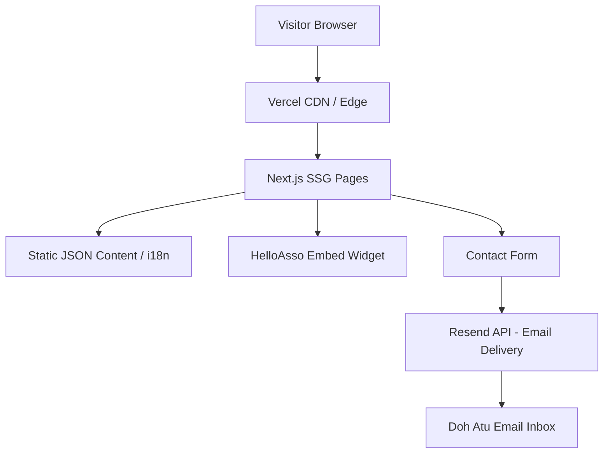

# PRD: Doh Atu Myanmar Website

> **Status:** Draft
> **Author:** Pyae Sone (Seon)
> **Date:** 2026-03-23
> **Last Updated:** 2026-03-23

---

## 1. Problem Statement

### What problem are we solving?

Doh Atu -- Ensemble pour le Myanmar is a Paris-based French association (loi 1901) founded in April 2022 that raises awareness about Myanmar's humanitarian crisis, advocates for democracy and human rights, and promotes Myanmar through culture, art, literature, and craftsmanship. Their previous website (doh-atu.com via GoDaddy) was lost due to payment/access issues, leaving the association with no web presence. They need a professional, self-owned website that they fully control, deployed on modern infrastructure with no vendor lock-in.

### Who has this problem?

- **Tin Tin Htar Myint** (President) and the Doh Atu association -- need a platform to amplify their mission
- **French public** -- need to learn about Myanmar's crisis (largely underreported in French media)
- **International supporters** -- diaspora, activists, and donors who want to help
- **Burmese community in France** -- need a rallying point and voice

### Why now?

Myanmar's crisis has only deepened since the 2021 coup. Over 5 years later, the military junta held sham elections (Dec 2025 / Jan 2026), 30,000+ people have been arrested, 3M+ displaced internally, and international funding is declining. The association has organized 16+ events but has no website to showcase their work, drive donations, or reach new supporters. The old GoDaddy site is gone -- this is a clean start with full ownership.

---

## 2. Success Criteria

### Primary Metric

A visitor can understand what Doh Atu does, learn about Myanmar's situation, and take action (donate, join, or contact) within 60 seconds of landing on the site.

### Secondary Metrics

- [ ] Site loads in under 2 seconds (Lighthouse performance > 90)
- [ ] Fully accessible (WCAG 2.1 AA compliance)
- [ ] SEO-optimized (metadata, Open Graph, semantic HTML)
- [ ] Trilingual content (French, English, Burmese) with seamless switching
- [ ] Mobile-first responsive design (44px touch targets, 16px min input font)

### What does "done" look like?

A polished, trilingual website at doh-atu-myanmar.com that tells the story of Doh Atu and Myanmar's fight for democracy. Visitors can browse the association's mission, read about the situation in Myanmar, explore past activities/events, donate or become a member via HelloAsso, and contact the association. Content is managed via the codebase (Seon updates).

---

## 3. User Stories & Acceptance Criteria

### Story 1: First-time visitor learns about the cause

**As a** first-time visitor, **I want to** immediately understand what Doh Atu is and why Myanmar matters, **so that** I can decide whether to learn more or take action.

**Acceptance Criteria:**

- [ ] Given I land on the homepage, when the page loads, then I see a compelling hero section with a clear tagline, the Doh Atu logo, and a CTA button
- [ ] Given I'm on the homepage, when I scroll down, then I see key statistics about Myanmar's crisis (displaced people, arrests, airstrikes) presented visually
- [ ] Given I'm on any page, when I look at the navigation, then I can access all main sections (Who We Are, News, Activities, Contact)
- [ ] Given I'm a French speaker, when I visit the site, then the default language is French

### Story 2: Visitor explores the association's work

**As a** supporter or journalist, **I want to** browse Doh Atu's past activities and events, **so that** I can understand their track record and credibility.

**Acceptance Criteria:**

- [ ] Given I navigate to the Activities page, when it loads, then I see a timeline or grid of 16+ events organized chronologically (2022-2024)
- [ ] Given I'm viewing an activity, when I look at it, then I see the event name, date, location, partners involved, and a photo if available
- [ ] Given I'm viewing the Partners section, when it loads, then I see logos of key partners (Ville de Paris, Amnesty International, Info Birmanie, etc.)

### Story 3: Visitor donates or becomes a member

**As a** sympathetic visitor, **I want to** donate money or join as a member, **so that** I can support Doh Atu's mission financially.

**Acceptance Criteria:**

- [ ] Given I click "Donate" or "Join" anywhere on the site, when the page loads, then I see an embedded HelloAsso widget for direct action
- [ ] Given the HelloAsso embed fails to load, when I'm on the donation page, then I see a fallback external link to the HelloAsso page
- [ ] Given I'm on any page, when I look at the header/footer, then I see a visible "Donate" CTA

### Story 4: Visitor switches language

**As a** non-French-speaking visitor (English or Burmese), **I want to** switch the site language, **so that** I can read content in my preferred language.

**Acceptance Criteria:**

- [ ] Given I'm on any page, when I click the language switcher, then I see FR / EN / MY options
- [ ] Given I switch to English, when the page re-renders, then all UI text and content is in English
- [ ] Given I switch to Burmese, when the page re-renders, then content displays in Burmese script with appropriate font rendering
- [ ] Given I switch language, when I navigate to another page, then the selected language persists

### Story 5: Visitor contacts the association

**As a** potential partner, volunteer, or media contact, **I want to** reach out to Doh Atu, **so that** I can propose a collaboration or ask questions.

**Acceptance Criteria:**

- [ ] Given I navigate to the Contact page, when it loads, then I see a contact form with name, email, subject, and message fields
- [ ] Given I submit the form with valid data, when I click send, then I see a success confirmation
- [ ] Given I submit with invalid data, when validation runs, then I see clear error messages per field
- [ ] Given I'm on the Contact page, when I look below the form, then I see the association's email and social media links

---

## 4. Technical Architecture

### Stack Decision

| Layer      | Choice                     | Why                                                                 |
| ---------- | -------------------------- | ------------------------------------------------------------------- |
| Framework  | Next.js 15 (App Router)    | SSG for performance, i18n support, Vercel-native, React 19          |
| Language   | TypeScript (strict)        | Type safety, better DX, matches team preference                     |
| Styling    | Tailwind CSS 4 + shadcn/ui | Utility-first, design tokens, accessible components                 |
| i18n       | next-intl                  | Best Next.js App Router i18n library, supports FR/EN/MY             |
| Forms      | React Hook Form + Zod      | Type-safe form handling with validation                             |
| Email      | Resend (free tier)         | Contact form email delivery, 100 emails/day free                    |
| Fonts      | next/font/google           | Noto Sans (body), Noto Serif Myanmar (Burmese), Playfair (headings) |
| Icons      | Lucide React               | Consistent SVG icon library                                         |
| Animations | Framer Motion              | Scroll animations, page transitions                                 |
| Hosting    | Vercel (free tier)         | Zero-config Next.js hosting, custom domain, auto-deploy from GitHub |
| CI/CD      | GitHub Actions             | Lint + type-check + build on every push                             |
| Analytics  | Vercel Analytics (free)    | Privacy-friendly, no cookies, GDPR compliant                        |

### Architecture Diagram



### Content Architecture

No database. All content is stored as structured TypeScript files:

```
content/
  fr/          -- French translations + content
  en/          -- English translations + content
  my/          -- Burmese translations + content
  events.ts    -- Event data (shared, language keys)
  partners.ts  -- Partner logos and links
  stats.ts     -- Myanmar crisis statistics
```

### API Design (Key Endpoints)

| Method | Endpoint     | Purpose             | Auth Required |
| ------ | ------------ | ------------------- | ------------- |
| POST   | /api/contact | Submit contact form | No            |

Single API route. Everything else is statically generated.

### Third-Party Dependencies

| Dependency    | Purpose               | Risk Level | Alternative               |
| ------------- | --------------------- | ---------- | ------------------------- |
| HelloAsso     | Donations/memberships | Low        | Direct bank transfer link |
| Resend        | Contact form emails   | Low        | Formspree, EmailJS        |
| Vercel        | Hosting               | Low        | Netlify, Cloudflare Pages |
| next-intl     | Internationalization  | Low        | next-i18next              |
| Framer Motion | Animations            | Low        | CSS animations            |

---

## 5. Design System

### Visual Identity: "Warm Minimalism"

Blending your friend's preference (simple, minimalist, pastel/eco-friendly) with warmth and hope.

### Color Palette (5 colors max)

| Token          | Color     | Hex       | Usage                                            |
| -------------- | --------- | --------- | ------------------------------------------------ |
| `primary`      | Gold      | `#C8943E` | CTAs, accents, links -- Myanmar's golden pagodas |
| `primary-dark` | Deep Gold | `#9B7230` | Hover states, active elements                    |
| `foreground`   | Charcoal  | `#1A1A1A` | Body text                                        |
| `background`   | Cream     | `#FAF7F2` | Page background -- warm, eco feel                |
| `muted`        | Warm Gray | `#E8E2D9` | Cards, borders, secondary backgrounds            |
| `accent`       | Deep Red  | `#8B2020` | Sparingly -- resistance, urgency                 |

### Typography

| Role     | Font               | Weight  | Usage               |
| -------- | ------------------ | ------- | ------------------- |
| Headings | Playfair Display   | 600-700 | H1-H3, hero text    |
| Body     | Noto Sans          | 400-600 | Body, UI elements   |
| Burmese  | Noto Serif Myanmar | 400-600 | Burmese text blocks |

### Layout Principles

- Max content width: 1200px
- Mobile-first breakpoints: 640px (sm), 768px (md), 1024px (lg)
- Section spacing: 80px-120px vertical rhythm
- Card/component spacing: `gap-6` (24px)
- Generous whitespace -- let content breathe

---

## 6. Page Structure

### Pages

| Page       | Route (FR)            | Route (EN)       | Description                                |
| ---------- | --------------------- | ---------------- | ------------------------------------------ |
| Homepage   | `/fr`                 | `/en`            | Hero, mission overview, stats, CTA         |
| Who We Are | `/fr/qui-sommes-nous` | `/en/about`      | Mission, history, team, story of Myanmar   |
| Activities | `/fr/activites`       | `/en/activities` | Timeline of 16+ events, photos, partners   |
| News       | `/fr/actualites`      | `/en/news`       | Updates, press mentions (future content)   |
| Support Us | `/fr/nous-soutenir`   | `/en/support`    | HelloAsso embed + external link, volunteer |
| Contact    | `/fr/contact`         | `/en/contact`    | Contact form, email, social links          |

### Homepage Sections (scroll order)

1. **Hero** -- Full-width with Doh Atu logo, tagline ("Ensemble pour le Myanmar"), CTA buttons (Learn More / Support Us), subtle background image
2. **Mission** -- 3-column grid: Awareness / Advocacy / Culture (matching their 3 pillars)
3. **The Situation** -- Key statistics with animated counters (30,000+ arrested, 3M+ displaced, etc.)
4. **Recent Activities** -- 3-4 latest events as cards
5. **Partners** -- Logo carousel/grid
6. **Call to Action** -- Final CTA banner (Join Us / Donate)
7. **Footer** -- Logo, navigation, social links, HelloAsso link, legal mentions

---

## 7. Edge Cases & Error Handling

| Scenario                      | Expected Behavior                                              | Priority |
| ----------------------------- | -------------------------------------------------------------- | -------- |
| HelloAsso embed fails         | Show fallback link "Complete your donation on HelloAsso"       | P0       |
| Contact form submission fails | Show user-friendly error, retry button, fallback email address | P0       |
| Burmese font fails to load    | Fallback to system Myanmar font, then to Latin script          | P1       |
| Slow connection               | SSG pages load instantly from CDN, images lazy-loaded          | P1       |
| Missing translation key       | Fall back to French (source language)                          | P1       |
| JS disabled                   | Core content readable (SSG HTML), forms show email fallback    | P2       |

### Security Considerations

- [ ] Contact form: rate limiting on API route (max 5/min per IP)
- [ ] Contact form: Zod validation server-side + client-side
- [ ] Contact form: honeypot field for bot prevention (no CAPTCHA -- better UX)
- [ ] No user authentication needed (public site)
- [ ] No database (no SQL injection surface)
- [ ] XSS: Next.js auto-escapes rendered content
- [ ] CORS: default Vercel CORS (same-origin API routes)
- [ ] Environment variables for Resend API key only

---

## 8. Testing Strategy

### Unit Tests (vitest)

- [ ] i18n: all translation keys exist in all 3 languages
- [ ] Contact form: Zod schema validation (valid + invalid inputs)
- [ ] Data: events, partners, stats data integrity

### Integration Tests

- [ ] API route `/api/contact`: valid submission, validation errors, rate limiting

### E2E Tests (Playwright)

- [ ] Homepage loads, hero is visible, navigation works
- [ ] Language switching FR -> EN -> MY preserves page context
- [ ] Contact form submission (happy path)
- [ ] Donation page: HelloAsso widget or fallback link visible

### What NOT to test

- HelloAsso widget internals (third-party)
- Resend email delivery (mock in tests)
- Visual pixel-perfect comparisons (not worth the maintenance)

---

## 9. Milestones & Build Order

### Phase 1: Foundation

- [ ] Project scaffolding (Next.js 15, TypeScript, Tailwind, shadcn/ui)
- [ ] Design system setup (globals.css tokens, fonts, base components)
- [ ] i18n setup (next-intl, FR/EN/MY routing)
- [ ] Layout: header, footer, navigation, language switcher
- [ ] CI pipeline (lint + type-check + build)
- **Gate:** Site renders in 3 languages with working navigation, CI green

### Phase 2: Core Pages

- [ ] Homepage (hero, mission, stats, activities preview, partners, CTA)
- [ ] Who We Are page (mission, history, Myanmar context from PDF content)
- [ ] Activities page (timeline/grid of all 16+ events)
- [ ] Content: populate all FR/EN/MY translations
- **Gate:** All content pages render correctly in 3 languages

### Phase 3: Interactive Features & Polish

- [ ] Support Us page (HelloAsso embed + fallback link)
- [ ] Contact page (form + Resend integration)
- [ ] News page (placeholder structure for future content)
- [ ] Animations (scroll reveal, page transitions)
- [ ] SEO (metadata, Open Graph images, sitemap.xml)
- [ ] Performance optimization (image optimization, lazy loading)
- [ ] E2E tests on critical paths
- **Gate:** All acceptance criteria met, Lighthouse > 90, deployed to Vercel

### Phase 4: Deploy & Launch

- [ ] GitHub repo: `doh-atu-myanmar`
- [ ] Vercel project connected to repo
- [ ] Custom domain: doh-atu-myanmar.com configured
- [ ] Final review with your friend
- **Gate:** Live at doh-atu-myanmar.com

---

## 10. Out of Scope (Explicitly)

- NOT building: Blog/CMS system (content managed in code by Seon)
- NOT building: User authentication or member portal
- NOT building: Payment processing (HelloAsso handles this entirely)
- NOT building: Admin dashboard
- NOT building: Newsletter system (can add Mailchimp/Buttondown later)
- NOT building: Event registration system
- Will revisit in v2: Blog with MDX, newsletter integration, event RSVP

---

## 11. Open Questions

- [ ] Does the association have social media accounts (Facebook, Instagram, Twitter/X) to link?
- [ ] Should the contact form emails go to a specific address (e.g., contact@doh-atu-myanmar.com)?
- [ ] Does your friend have high-resolution versions of the event photos from the presentation?
- [ ] Should we include the "Doh Atu" Burmese script logo as an SVG, or use the JPEG provided?
- [ ] Any legal mentions required (French association loi 1901 legal page)?

---

## 12. Approval

- [ ] **PRD reviewed and understood** -- I (Seon) confirm the requirements are clear
- [ ] **Architecture approved** -- The technical approach makes sense
- [ ] **Scope locked** -- No features will be added during build without updating this PRD

> **Once approved, this PRD becomes the source of truth. Every feature, every endpoint, every component traces back to a user story above. If it's not in the PRD, it's not getting built.**
